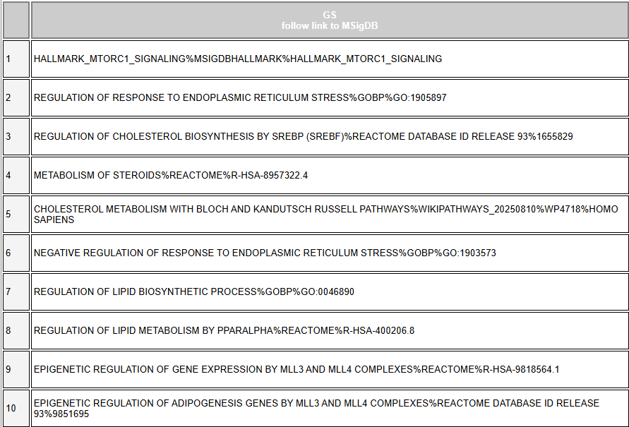
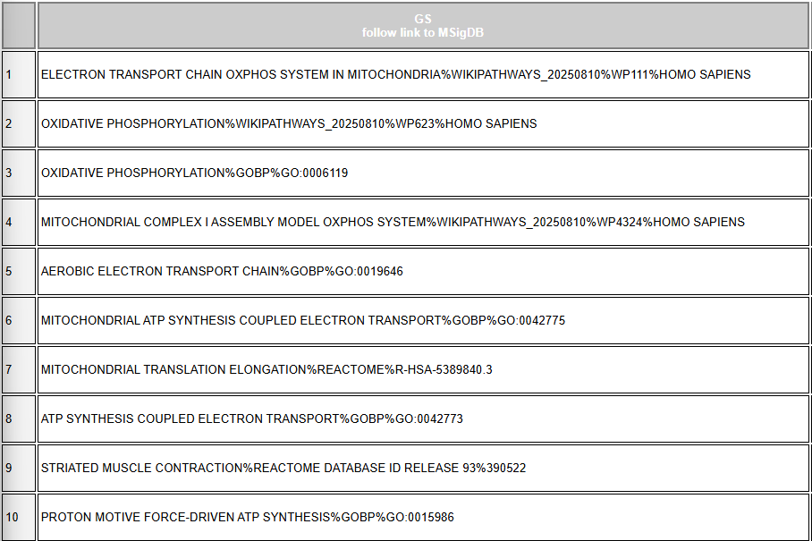
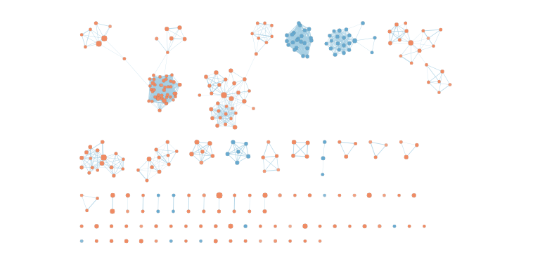
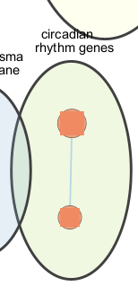
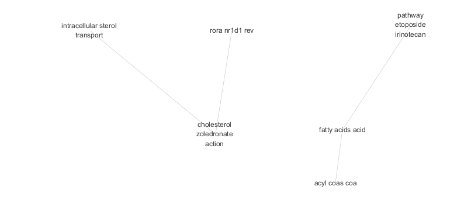
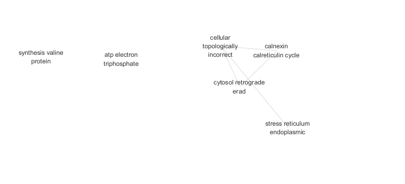

# 0 Introduction

This analysis investigates transcriptional responses to **palmitate treatment**, with a particular focus on identifying biological pathways associated with lipid metabolism and potential circadian regulation. The dataset analyzed in this report originates from the study *Saturated Fat Impairs Circadian Transcriptomics through Histone Modification of Enhancers [@Pillon2021.02.23.432336]*. In the original study, palmitate treatment was shown to alter metabolic pathways while disrupting circadian rhythmicity in skeletal muscle cells.

Raw gene expression data were obtained from the **Gene Expression Omnibus (GEO)** database and processed using the **edgeR** differential expression analysis framework. The analysis pipeline followed standard RNA-seq normalization and statistical modeling procedures. Gene counts were first normalized to account for library size differences using **trimmed mean of M-values (TMM) normalization**, which corrects for compositional bias across samples. After normalization, dispersion parameters were estimated to model biological variability between samples.

```{r load, include=FALSE}
required_pkgs <- c(
  "DBI",
  "RSQLite",
  "biomaRt",
  "dplyr",
  "edgeR",
  "gprofiler2",
  "GSA",
  "BiocManager",
  "RCy3",
  "httr",
  "tidyr",
  "stringr"
)

for (pkg in required_pkgs) {
  if (!requireNamespace(pkg, quietly = TRUE)) {
    install.packages(pkg)
  }
  library(pkg, character.only = TRUE)
}
```

Here we demonstrate the steps for reinspect the data. hypothesis testing.

```{r reload-datasets}
## ---- load-a1-objects ----

obj <- readRDS("data/d1_qc_objects.rds")

dge  <- obj$dge_filtered
meta <- obj$meta
mappings <- obj$mappings
```

Recreate design matrix

To account for the experimental design, a generalized linear model was constructed including both **timepoint** and **treatment** variables. The design matrix included multiple sampling timepoints and a binary variable representing palmitate treatment:

```{r recreate design}
## ---- recreate-design ----

meta$timepoint <- factor(meta$timepoint)
meta$treatment <- factor(meta$treatment, levels = c("CTL", "PAL"))

design <- model.matrix(~ timepoint + treatment, data = meta)
```

This model structure allowed us to isolate the transcriptional effect of palmitate treatment while controlling for temporal variation.

Re-estimate dispersion and fit QL model

```{r refit QL}
## ---- fit-edger-model ----

dge <- estimateDisp(dge, design)

fit <- glmQLFit(dge, design)
```

Plotting BCV:

```{r BCV}
plotBCV(dge)
```

Figure 1. BCV graph from the last analysis, Plotting using the normalized data using timepoint + treatment design.

Hypothesis testing

```{r ql-test}
## ---- ql-test ----

qlf_pal_vs_ctl <- glmQLFTest(
  fit,
  coef = "treatmentPAL"
)

res_pal <- topTags(qlf_pal_vs_ctl, n = Inf)$table %>%
  tibble::rownames_to_column("ensembl")
```

Verify same number of gene as the last analysis:

Using P value cutoff, there are 1223 genes that are differentially expressed:

```{r}
sum(res_pal$PValue < 0.05)
```

Using FDR cutoff, there are 14 genes that are differentially expressed

```{r}
sig_res <- res_pal %>%
  filter(FDR < 0.05, abs(logFC) >= 1)

nrow(sig_res)
```

Dispersion estimates were obtained using edgeR, and a **quasi-likelihood (QL) negative binomial model** was fitted to the data. The biological coefficient of variation (BCV) was inspected to confirm appropriate dispersion estimation and to assess variability across genes.

Differential expression testing was then performed using quasi-likelihood F-tests. The results revealed:

-    **1223 genes** with nominal significance at **p \< 0.05**

-    **14 genes** that remained significant after **false discovery rate (FDR) correction**

These results indicate that while many genes show moderate expression changes under palmitate treatment, relatively few genes pass stringent multiple-testing correction thresholds. This pattern suggests that coordinated but modest expression changes across groups of genes may play an important biological role.

To capture these broader biological signals, pathway-level analyses were performed using two complementary approaches:

1.   **Thresholded Over-Representation Analysis (ORA)** using significantly differentially expressed genes.

2.   **Non-thresholded Gene Set Enrichment Analysis (GSEA)** using a ranked list of all genes.

Together, these approaches allow identification of biological pathways that are over-represented among strongly differentially expressed genes as well as pathways showing coordinated expression changes across the entire transcriptome.

The following sections describe the pathway enrichment analyses and their visualization using Cytoscape enrichment maps.

# 1 Threshold Over-Representation

## 1.1 Perform ORA

In order to perform threshold ORA, we split the genes meeting 0.05 FDR cutoff to up and down group by the sign of the fold change. The result shows 11 genes where in up group and only 3 in the down regulated group.

```{r}
sig_up <- sig_res %>% filter(logFC > 0)
sig_down <- sig_res %>% filter(logFC < 0)

nrow(sig_up)
nrow(sig_down)
```

Here we present the steps to perform Threshold ORA:

```{r Sources}
gprofsources = c("GO:BP", "REAC", "WP")
```

Enrichment analysis was performed using g:Profiler (version 2025-03-16) with Homo sapiens annotation databases including GO (BP, MF, CC), Reactome, WikiPathways, KEGG, transcription factor targets, microRNA targets, CORUM complexes, Human Protein Atlas, and Human Phenotype Ontology.

Annotation version

```{r Report Version, include = FALSE}
get_version_info(organism = "hsapiens")
```

Inspect gene lists

```{r inspect gene lists, include = FALSE}
head(sig_up)
```

Extract the Gene list by unique ensembl or biomart symbel.

```{r Create gene symbel only list}
genes_up   <- unique(sig_up$ensembl)
genes_down <- unique(sig_down$ensembl)
genes_all  <- unique(sig_res$ensembl)

length(genes_up)
length(genes_down)
```

Run Upregulated

```{r up}
gost_up <- gost(
  query = genes_up,
  organism = "hsapiens",
  significant = FALSE,
  ordered_query = FALSE,
  exclude_iea = TRUE,
  correction_method = "fdr",
  sources = gprofsources
)

res_up <- gost_up$result
```

Run Downregulated

```{r down}
gost_down <- gost(
  query = genes_down,
  organism = "hsapiens",
  significant = FALSE,
  ordered_query = FALSE,
  exclude_iea = TRUE,
  correction_method = "fdr",
  sources = gprofsources
)

res_down <- gost_down$result
```

Combined

```{r all}
gost_all <- gost(
  query = genes_all,
  organism = "hsapiens",
  significant = FALSE,
  ordered_query = FALSE,
  exclude_iea = TRUE,
  correction_method = "fdr",
  sources = gprofsources
)

res_all <- gost_all$result
```

We performed thresholded over-representation analysis (ORA) using the gprofiler2::gost() function with the following parameters:

query = genes_up / genes_down / genes_all

The query represents the list of significantly differentially expressed genes identified from edgeR analysis (FDR \< 0.05 and \|log2FC\| ≥ 1). Up-regulated, down-regulated, and combined gene sets were analyzed separately to preserve biological directionality.

organism = "hsapiens"

The organism parameter specifies that Homo sapiens annotation databases were used for enrichment analysis.

significant = FALSE

We set significant = FALSE to retrieve all enrichment results rather than restricting output to only those passing g:Profiler’s internal significance threshold. This allows us to apply our own filtering criteria downstream.

ordered_query = FALSE

Because this analysis is thresholded ORA (not ranked GSEA), genes were treated as an unranked set. Therefore, ordered_query = FALSE was appropriate.

exclude_iea = TRUE

Inferred Electronic Annotations (IEA) were excluded to increase annotation reliability by limiting enrichment to manually curated or experimentally supported terms.

correction_method = "fdr"

Multiple hypothesis correction was performed using the Benjamini–Hochberg False Discovery Rate (FDR) method to control for false positives across many tested gene sets.

sources = gprofsources

The following annotation databases were included:

<GO:BP> (Biological Process)

<GO:MF> (Molecular Function)

<GO:CC> (Cellular Component)

REAC (Reactome pathways)

WP (WikiPathways)

KEGG

TF (Transcription factor targets)

MIRNA (miRNA target sets)

CORUM (protein complexes)

HPA (Human Protein Atlas)

HP (Human Phenotype Ontology)

Including multiple annotation sources allows interrogation of biological processes, pathways, regulatory networks, and disease associations.

## 1.2 Biological expectation based on the original study

The original study used the **RAIN algorithm** to identify genes exhibiting circadian rhythmicity and to determine how palmitate treatment affects rhythmic gene expression. The authors reported that palmitate treatment primarily altered the **rhythmic cycling behavior of genes**, while having minimal effects on the **overall expression levels of core circadian clock components**.

In contrast, genes whose overall expression levels changed after palmitate exposure were strongly associated with **lipid metabolic pathways**.

Specifically, the paper states that:

> “Palmitate-responsive genes were associated with gene ontology pathways related to lipid metabolism.”

Based on this observation, we expect enrichment analysis of differentially expressed genes to identify pathways related to lipid metabolism.

Typical Gene Ontology Biological Process terms associated with lipid metabolism include:

-   lipid metabolic process

-   fatty acid metabolic process

-   fatty acid beta-oxidation

-   lipid biosynthetic process

-   sterol metabolic process

-   lipid transport

These pathways serve as biological benchmarks for evaluating the enrichment analysis results.

If the ORA analysis identifies these lipid-related pathways as significantly enriched, it would indicate that the pathway analysis successfully captures the biological processes described in the original study.

## 1.3 Result Analysis

Here we present the steps to create summery of the result:

Group by biological themes

```{r keyword rules}
classify_theme <- function(df) {
  df %>%
    mutate(
      theme = case_when(
        str_detect(term_name, regex("circadian|clock|rhythm", ignore_case = TRUE)) ~ "Circadian",
        str_detect(term_name, regex("lipid|fatty|cholesterol|sterol|acyl", ignore_case = TRUE)) ~ "Lipid metabolism",
        TRUE ~ "Other"
      )
    )
}
```

```{r Apply classification}
res_up_theme   <- classify_theme(res_up)
res_all_theme  <- classify_theme(res_all)
```

Count numbers of gene set of each theme

```{r count}
count_theme <- function(df, label) {
  df %>%
    group_by(theme) %>%
    summarise(count = n(), .groups = "drop") %>%
    mutate(group = label)
}

summary_up   <- count_theme(res_up_theme, "Upregulated")
summary_all  <- count_theme(res_all_theme, "All")
```

```{r threshold summery}
threshold_summary <- bind_rows(
  summary_up,
  summary_all
)

themes <- c("Lipid metabolism", "Circadian", "Other")
groups <- c("Upregulated", "Downregulated", "All")

threshold_summary <- threshold_summary %>%
  complete(group = groups, theme = themes, fill = list(count = 0))
```

Plotting the summery

```{r plot}
library(ggplot2)

ggplot(threshold_summary, aes(x = group, y = count, fill = theme)) +
  geom_bar(stat = "identity", position = "dodge") +
  theme_minimal() +
  labs(
    title = "Enriched genesets by biological theme (Thresholded ORA)",
    x = "Gene set",
    y = "Number of genesets",
    fill = "Theme"
  )
```

Figure.2 Summery of gene set counts for up regulated genesets, down regulated genesets and both gene sets combined.

```{r table of top term}
get_top_terms <- function(df, group_name) {
  df %>%
    group_by(theme) %>%
    slice_min(p_value, n = 1, with_ties = FALSE) %>%
    ungroup() %>%
    select(theme, top_term = term_name, p_value) %>%
    mutate(group = group_name)
}

top_up  <- get_top_terms(res_up_theme, "Upregulated")
top_all <- get_top_terms(res_all_theme, "All")

top_terms <- bind_rows(top_up, top_all)

themes <- c("Lipid metabolism", "Circadian", "Other")
groups <- c("Upregulated", "Downregulated", "All")

top_terms <- top_terms %>%
  complete(group = groups, theme = themes,
           fill = list(top_term = NA, p_value = NA))

threshold_summary_table <- threshold_summary %>%
  left_join(top_terms, by = c("group", "theme"))

knitr::kable(
  threshold_summary_table,
  caption = "Summary of enriched pathways by biological theme with top representative term"
)
```

Table 1. Summery of top term and significant level for each theme.

Interpertation: the g:profiling by fdr cutoff o.o5 did not identify any significant circardian gene set, but identified 53 lipid metabolism related geneset and 579 other geneset in using the positive experssed gene list.

## 1.4 Comparison of up-regulated, down-regulated, and combined gene sets

Using both positive and negative gene together did not effect the results as no significant gene set for 3 negative regulated gene added. see table 1, figure 2.

We performed size filtered results reusing similar code, the size cutoff is 3\< size \< 250 to remove any large general pathways.

```{r filter size}
min_gs_size <- 3
max_gs_size <- 250
min_intersection <- 2

res_up_f <- subset(res_up,
                   term_size >= min_gs_size &
                   term_size <= max_gs_size &
                   intersection_size >= min_intersection)

res_all_f <- subset(res_all,
                    term_size >= min_gs_size &
                    term_size <= max_gs_size &
                    intersection_size >= min_intersection)

classify_theme <- function(df) {
  df %>%
    mutate(
      theme = case_when(
        str_detect(term_name, regex("circadian|clock|rhythm", ignore_case = TRUE)) ~ "Circadian",
        str_detect(term_name, regex("lipid|fatty|cholesterol|sterol|acyl", ignore_case = TRUE)) ~ "Lipid metabolism",
        TRUE ~ "Other"
      )
    )
}

res_up_f_theme  <- classify_theme(res_up_f)
res_all_f_theme <- classify_theme(res_all_f)

count_theme <- function(df, label) {
  df %>%
    group_by(theme) %>%
    summarise(count = n(), .groups = "drop") %>%
    mutate(group = label)
}

summary_up_f  <- count_theme(res_up_f_theme, "Upregulated")
summary_all_f <- count_theme(res_all_f_theme, "All")

filtered_summary <- bind_rows(summary_up_f, summary_all_f)

get_top_terms <- function(df, group_name) {
  df %>%
    group_by(theme) %>%
    slice_min(p_value, n = 1, with_ties = FALSE) %>%
    ungroup() %>%
    select(theme, top_term = term_name, p_value) %>%
    mutate(group = group_name)
}

top_up_f  <- get_top_terms(res_up_f_theme, "Upregulated")
top_all_f <- get_top_terms(res_all_f_theme, "All")

top_terms_f <- bind_rows(top_up_f, top_all_f)

themes <- c("Lipid metabolism", "Circadian", "Other")
groups <- c("Upregulated", "All")

filtered_summary <- filtered_summary %>%
  complete(group = groups, theme = themes, fill = list(count = 0))

top_terms_f <- top_terms_f %>%
  complete(group = groups, theme = themes,
           fill = list(top_term = NA, p_value = NA))

filtered_summary_table <- filtered_summary %>%
  left_join(top_terms_f, by = c("group", "theme"))

knitr::kable(
  filtered_summary_table,
  caption = "Filtered ORA pathway summary with representative term per biological theme"
)
```

Table 2. Top term anhd count for each theme after filtering geneset size 3\<size\<200.

### Interpretation of Filtered ORA Results

After filtering gene sets by size and intersection criteria, the number of lipid metabolism–related pathways decreased compared to the unfiltered results. This filtering step removes very small gene sets and overly broad categories, resulting in a more specific set of enriched pathways. In the filtered results, **8 pathways were associated with lipid metabolism**, **52 pathways were categorized as other biological processes**, and **no circadian-related pathways were identified**.

These results are consistent with the conclusions of the original study. The authors reported that palmitate treatment alters **circadian rhythmicity** rather than the overall **expression levels of core circadian clock genes**. Specifically, a large fraction of genes that normally exhibit circadian oscillations lose their rhythmic cycling after palmitate treatment. However, the expression levels of core clock machinery components remain largely unchanged.

Because over-representation analysis (ORA) relies on **differentially expressed genes**, pathways associated with circadian regulation may not appear enriched if the genes involved maintain similar average expression levels despite losing their rhythmic behavior. In other words, the disruption occurs at the level of **temporal gene expression patterns rather than changes in overall expression abundance**.

Therefore, the absence of circadian gene sets in the ORA results is consistent with the biological mechanism described in the paper. The enrichment of lipid metabolism pathways further supports the known metabolic effects of palmitate treatment on skeletal muscle cells.

# 2 Non-Threshold Enrichment Analysis

Here we demonstrate the steps for performing Non-Threshold Enrichment Analysis using GSEA

```{r output location}
working_dir <- "./data"
```

create ranked gene list from previous analysis

```{r ranked gene list}
library(dplyr)

# Create ranked table
res_rank <- res_pal %>%
  mutate(rank_score = sign(logFC) * -log10(PValue)) %>%
  arrange(desc(rank_score))

# Keep only required columns
rnk_df <- res_rank %>%
  select(ensembl, rank_score)

# Define file path
working_dir <- "./data"
dir.create(working_dir, showWarnings = FALSE)

rnk_file <- "PAL_vs_CTL_ranked.rnk"
rnk_path <- file.path(working_dir, rnk_file)

# Write .rnk file
write.table(
  rnk_df,
  file = rnk_path,
  sep = "\t",
  row.names = FALSE,
  col.names = FALSE,
  quote = FALSE
)
```

Download fixed version fir GMT from Baderlab

```{r download GMT}
library(RCurl)

output_dir <- "./generated_data/gsea"
dir.create(output_dir, recursive = TRUE, showWarnings = FALSE)

gmt_url  <- "https://download.baderlab.org/EM_Genesets/September_01_2025/Human/symbol/Human_GOBP_AllPathways_noPFOCR_no_GO_iea_September_01_2025_symbol.gmt"

gmt_file <- "Human_GOBP_AllPathways_noPFOCR_no_GO_iea_September_01_2025_symbol.gmt"
gmt_path <- file.path(output_dir, gmt_file)

if (!file.exists(gmt_path)) {
  download.file(gmt_url, destfile = gmt_path, mode = "wb")
}
```

September 01, 2025 GO BP + Pathways No IEA Human symbols

Configure GSEA CLI

```{r }
gsea_jar <- path.expand("~/GSEA_4.4.0/gsea-cli.sh")
```

Run:

```{r run GSEA, eval = FALSE}
analysis_name <- "PAL_vs_CTL"

gsea_stdout <- file.path(output_dir, "gsea_output.txt")

command <- paste(
  shQuote(gsea_jar),
  "GSEAPreRanked",
  "-gmx", shQuote(gmt_path),
  "-rnk", shQuote(rnk_path),
  "-collapse false",
  "-nperm 1000",
  "-scoring_scheme weighted",
  "-rpt_label", shQuote(analysis_name),
  "-plot_top_x 20",
  "-rnd_seed 12345",
  "-set_max 200",
  "-set_min 15",
  "-zip_report false",
  "-out", shQuote(output_dir),
  ">", shQuote(gsea_stdout)
)

cat("Running command:\n", command, "\n")
system(command)
```

## 2.1 Non-Thresholded Gene Set Enrichment Analysis

To identify coordinated biological pathways associated with palmitate treatment, we performed **non-thresholded Gene Set Enrichment Analysis (GSEA)** using the **GSEA PreRanked algorithm** implemented in the **Broad Institute GSEA software (version 4.4.0)** (Subramanian et al., 2005).

### Ranked gene list

A ranked gene list was generated from the differential expression results (`res_pal`) obtained in the previous assignment. Genes were ranked using a score that combines both the **direction** and **statistical strength** of differential expression:

rank score=sign(log2​FC)×−log10​(P-value)

This ranking places strongly up-regulated genes at the top of the list and strongly down-regulated genes at the bottom, while incorporating statistical significance. The Raw P value is used as GSEA has internal rules of handling multiple hypothesis correction. The ranked gene list was exported as a `.rnk` file and used as input for the GSEAPreRanked analysis.

### Gene set database

Gene sets were obtained from the Bader Lab Gene Matrix Transposed (GMT) repository [@BaderLabGenesets2025]:

Human_GOBP_AllPathways_noPFOCR_no_GO_iea_September_01_2025_symbol.gmt

This dataset includes:

-   Gene Ontology Biological Process (GO BP)

-   curated biological pathway collections

The annotation file corresponds to the September 01, 2025 release and uses human gene symbols. Inferred electronic annotations (IEA) were excluded to prioritize curated or experimentally supported functional annotations.

### GSEA parameters

The analysis was performed using the **GSEAPreRanked** method with the following parameters:

-   Permutation number: 1000

-   Scoring scheme: weighted enrichment statistic

-   Minimum gene set size: 15

-   Maximum gene set size: 200

-   Random seed: 12345

Restricting gene set sizes to **15–200 genes** reduces noise from very small gene sets while excluding overly broad pathways that may lack biological specificity.

## 2.2 Summary of Enrichment Results

The non-thresholded Gene Set Enrichment Analysis (GSEA) identified several significantly enriched pathways associated with **lipid metabolism and metabolic stress responses**.

Among the positively enriched pathways were processes related to:

-   mTORC1 signaling

-   regulation of cholesterol biosynthesis

-   lipid biosynthetic processes

-   PPAR-α regulated lipid metabolism

-   steroid metabolism

-   endoplasmic reticulum (ER) stress response

These pathways showed high normalized enrichment scores (**NES ≈ 2.3–2.5**) and strong statistical significance (figure 3).

**Figure 3.** 

**Figure 3.** Top 10 positive enrichment gene sets report returned by GSEA on the pre ranked full gene list.

In contrast, several pathways related to **mitochondrial respiration and oxidative phosphorylation** were negatively enriched (figure 4)

**Figure 4.** 

**Figure 4**. Top 10 negative enriched gene set return by GSEA report run on pre ranked gene set

Overall, the enrichment pattern indicates that **palmitate treatment strongly affects lipid metabolic pathways and cellular stress responses**, which is consistent with the known lipotoxic effects of saturated fatty acids.

Circadian-related pathways were detected only weakly and were not among the most significant results. For example, gene sets associated with circadian clock regulation showed relatively low enrichment scores and non-significant FDR values.

## 2.3 Comparison with Thresholded ORA

The non-thresholded GSEA analysis provides a complementary perspective because it considers **all genes ranked by differential expression**, rather than only those passing a predefined significance threshold.

Compared with the thresholded ORA results:

-   GSEA detected **stronger enrichment of coordinated metabolic pathways**.

-   Lipid metabolism and cholesterol biosynthesis pathways were clearly enriched.

-   Additional metabolic stress pathways, such as **ER stress and mTOR signaling**, were also identified.

However, circadian pathways remained weakly enriched even in the non-thresholded analysis.

Is this a straightforward comparison?

The comparison between thresholded ORA and non-thresholded GSEA is **not straightforward**, because the two methods rely on different statistical assumptions.

ORA tests whether a predefined set of significant genes is over-represented within known pathways. Therefore, the results depend strongly on the differential expression threshold used to define significant genes.

In contrast, GSEA evaluates whether genes belonging to a pathway tend to appear toward the top or bottom of a ranked gene list, allowing detection of **coordinated but subtle expression changes** across many genes.

As a result, GSEA can identify biologically meaningful pathways even when individual genes do not pass strict differential expression thresholds.

Overall, while both analyses highlight **lipid metabolism as the dominant biological response to palmitate treatment**, GSEA provides a more comprehensive view of coordinated pathway regulation that missed by thresholded ORA. But at the cost of larger result set to analysis on.

# 3 Cytoscape Visualization of Non-Thresholded GSEA Results

## 3.1 Enrichment Map Construction

The non-thresholded GSEA results were visualized in Cytoscape using the **EnrichmentMap** workflow. In this network representation, each node corresponds to an enriched gene set, and edges represent the similarity between gene sets based on gene overlap. Node colors indicate the signed enrichment score, where orange represents positively enriched pathways and blue represents negatively enriched pathways.

The EnrichmentMap was generated using the following thresholds:

-   **FDR q-value cutoff:** 0.05

-   **Edge similarity cutoff:** 0.375

-   **Similarity metric:** Jaccard + overlap coefficient (default EnrichmentMap metric)

-   **Gene set size limits:** 15–200 genes

Under these thresholds, the resulting network contained:

-   **Nodes (gene sets):** *293*

-   **Edges (similarity relationships):** 1594

The raw enrichment map prior to manual layout is shown in **Figure 5**.



**Figure 5.** Raw EnrichmentMap network generated from non-thresholded GSEA results prior to manual layout. Nodes represent enriched gene sets and edges represent pathway similarity based on overlapping genes.

## 3.2 Network Annotation

The enrichment map was annotated using the **AutoAnnotate** Cytoscape application. Clusters of related gene sets were automatically detected and labeled using the **WordCloud** labeling algorithm.

Annotation parameters were:

-   **Label column:** `GS_DESCR`

-   **Cluster detection level:** middle

-   **Maximum words per label:** 3

-   **Minimum word occurrence:** 1

-   **Adjacent word bonus:** 8

-   **Label generation:** WordCloud app

This process grouped related pathways into biologically interpretable clusters. The annotated enrichment map of the overview of the pathways is show in figure 6.

**Figure 6**.


**Figure 6.** Annotated enrichment map after AutoAnnotate clustering. Pathways with overlapping gene content are grouped into clusters and labeled with representative biological terms.

**Legend 6.**

**Legend 6.**

### Circadian Gene set

There is one small fraction of the gene set of circadian genes. Zooming in we see two gene sets of human circadian rythmic gene set.

**Figure 7**. 

**Figure 7.** Zoomed in Screen shot of the two group of circadian rhythm genes.

## 3.3 Collapsed Theme Network

To further simplify interpretation, the annotated network was collapsed into a **theme network**, where each node represents a cluster of related pathways rather than individual gene sets. This representation highlights the major biological themes emerging from the enrichment analysis.

The major themes identified include:

| Theme                                  | Cluster size |
|----------------------------------------|--------------|
| Synthesis / translation pathways       | 22           |
| ATP / electron transport               | 21           |
| Regulation of biosynthetic processes   | 17           |
| Fatty acid metabolism                  | 16           |
| Acyl-CoA metabolism                    | 13           |
| Plasma lipoprotein homeostasis         | 11           |
| Intracellular sterol transport         | 8            |
| ER stress / unfolded protein response  | 6            |
| Mitochondrial translation / metabolism | 6            |
| Hypoxia / oxygen response              | 6            |
| miRNA transcription regulation         | 5            |
| Calnexin–calreticulin cycle            | 4            |
| Epigenetic regulation (MLL4 complexes) | 4            |
| DNA repair (base excision repair)      | 3            |
| Lipid storage localization             | 3            |

Table 3. Biological Themes presented after clustering with Autoannotation

A small cluster associated with **circadian rhythm genes** was also detected as mentioned above in figure 3:

-   **CIRCADIAN RHYTHM GENES (WikiPathways WP3594)**

-   **CIRCADIAN RHYTHM (<GO:0007623>)**

This cluster contained **two pathways**, indicating that circadian gene sets were detected but formed a relatively small module compared to metabolic pathways.

**Figure 8.** 

 **Figure 8.**Collapsed theme network summarizing major biological processes represented in the enrichment map. Each node represents a cluster of related pathways.

## 3.4 Interpretation of Cytoscape Results

## Relationship to the original paper

The enrichment map strongly supports the conclusions of the original study. The dominant clusters correspond to **lipid metabolism and cholesterol metabolism pathways**, including fatty acid metabolism, acyl-CoA processing, sterol transport, and lipoprotein homeostasis. These pathways are consistent with the biological response expected from palmitate treatment, which increases lipid availability and triggers metabolic rewiring [@EckelMahan2013].

The original paper reported that palmitate-responsive genes were enriched in **lipid metabolic processes**, supporting the idea that saturated fatty acids alter metabolic pathways in skeletal muscle cells.

In contrast, the circadian cluster is small and weakly connected in the network. This observation aligns with the findings of the paper, which showed that palmitate alters the **rhythmicity of gene expression** rather than the steady-state expression of core clock genes. As a result, circadian genes do not appear strongly enriched in differential expression–based analyses. [@EckelMahan2013]

The detection of a small circadian module in the non-thresholded GSEA, but not in the thresholded ORA analysis, supports this interpretation. GSEA can detect coordinated but subtle shifts in gene sets even when individual genes do not pass differential expression thresholds.

### Differences from Thresholded ORA

Compared with the thresholded ORA performed earlier:

**Thresholded ORA**

-   identified lipid metabolism pathways

-   did not detect circadian pathways

-   was dominated by strongly differentially expressed genes

**Non-thresholded GSEA**

-   detected lipid metabolism again

-   revealed additional biological modules

-   identified a small circadian gene cluster

-   highlighted stress and epigenetic regulatory pathways

Because GSEA analyzes the entire ranked gene list, it is able to detect **coordinated pathway shifts** even when individual genes show only modest changes.

### Additional biological insights

Several additional clusters revealed interesting biological signals beyond lipid metabolism:

**ER stress and unfolded protein response**

Clusters such as *calnexin–calreticulin cycle*, *cytosol retrograde ERAD*, and *XBP1 activates chaperones* indicate activation of protein quality-control pathways. These responses are known to occur under **lipotoxic stress caused by saturated fatty acids**. [@Hotamisligil2010]

**Epigenetic regulation**

Clusters related to **MLL4 epigenetic complexes** and transcriptional regulation suggest chromatin-level regulatory processes. This is consistent with the mechanism described in the paper, where palmitate alters enhancer activity through **histone H3K27 acetylation**. [@Creyghton2010]

**Mitochondrial and metabolic pathways**

Modules related to **ATP production, electron transport, and mitochondrial translation** indicate alterations in cellular energy metabolism, which is expected during fatty-acid–induced metabolic stress.

### Overall interpretation

Together, the Cytoscape enrichment map reveals that palmitate treatment primarily affects **lipid metabolism, mitochondrial metabolism, and stress-response pathways**, while circadian pathways are only weakly represented. This pattern strongly supports the model proposed in the original study: palmitate disrupts circadian transcriptomics primarily through metabolic and epigenetic mechanisms to effect rhythmic behaviour rather than through large changes in the expression levels of core clock genes.

However, it also demonstrates the limits of pure diffrential experession analysis in these circadian genen sets without dedicated rhythmic expression algorithm. Comparing to the original paper we are unable to identify if the genes starts or stops rhythmic behavior to further hypothesis the relation of the lipid metabolic and epigenetic pathways to these rhythmic genes in this case that overall expression level is not significant altered.

# 4 Answers and Conclusion

The Headers are named to match the corresponding questions in the order of the questions. Please use the table of content to browse directly to each question.

## 4.1 Conclusion

In this study, we analyzed RNA-seq data to investigate the transcriptional effects of palmitate treatment using differential expression and pathway enrichment analyses. Differential expression analysis identified relatively few genes passing strict FDR thresholds, suggesting that palmitate induces modest but coordinated transcriptional changes. Thresholded ORA highlighted pathways related to **lipid metabolism**, while non-thresholded GSEA revealed broader metabolic and stress-response pathways including **cholesterol biosynthesis, fatty acid metabolism, and ER stress**. Cytoscape enrichment maps further showed that lipid metabolic pathways form the dominant functional modules. Circadian-related pathways were weakly enriched, consistent with the original study’s finding that palmitate primarily affects **rhythmic gene behavior rather than steady-state expression levels of core clock genes**. Overall, the results support the model that palmitate disrupts circadian biology indirectly through metabolic and epigenetic mechanisms.

# Reference
